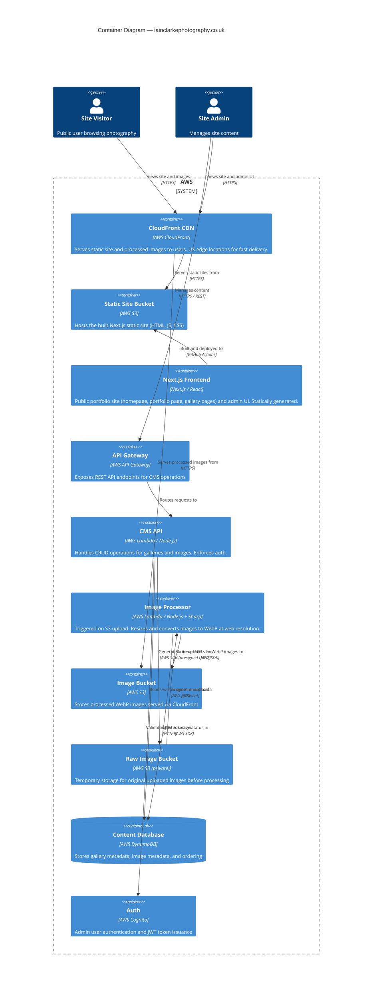

# C4 Level 2 — Containers

```mermaid
C4Container
    title Container Diagram — iainclarkephotography.co.uk

    Person(visitor, "Site Visitor", "Public user browsing photography")
    Person(admin, "Site Admin", "Manages site content")

    System_Boundary(aws, "AWS") {
        Container(cloudfront, "CloudFront CDN", "AWS CloudFront", "Serves static site and processed images to users. UK edge locations for fast delivery.")
        Container(s3Site, "Static Site Bucket", "AWS S3", "Hosts the built Next.js static site (HTML, JS, CSS)")
        Container(nextjs, "Next.js Frontend", "Next.js / React", "Public portfolio site (homepage, portfolio page, gallery pages) and admin UI. Statically generated.")
        Container(apiGateway, "API Gateway", "AWS API Gateway", "Exposes REST API endpoints for CMS operations")
        Container(apiLambda, "CMS API", "AWS Lambda / Node.js", "Handles CRUD operations for galleries and images. Enforces auth.")
        Container(imageProcessor, "Image Processor", "AWS Lambda / Node.js + Sharp", "Triggered on S3 upload. Resizes and converts images to WebP at web resolution.")
        Container(s3Images, "Image Bucket", "AWS S3", "Stores processed WebP images served via CloudFront")
        Container(s3Raw, "Raw Image Bucket", "AWS S3 (private)", "Temporary storage for original uploaded images before processing")
        ContainerDb(dynamo, "Content Database", "AWS DynamoDB", "Stores gallery metadata, image metadata, and ordering")
        Container(cognito, "Auth", "AWS Cognito", "Admin user authentication and JWT token issuance")
    }

    Rel(visitor, cloudfront, "Views site and images", "HTTPS")
    Rel(admin, cloudfront, "Views site and admin UI", "HTTPS")
    Rel(admin, apiGateway, "Manages content", "HTTPS / REST")
    Rel(cloudfront, s3Site, "Serves static files from", "HTTPS")
    Rel(cloudfront, s3Images, "Serves processed images from", "HTTPS")
    Rel(nextjs, s3Site, "Built and deployed to", "GitHub Actions")
    Rel(apiGateway, apiLambda, "Routes requests to", "")
    Rel(apiLambda, dynamo, "Reads/writes content metadata", "AWS SDK")
    Rel(apiLambda, s3Raw, "Generates upload URLs for", "AWS SDK (presigned URLs)")
    Rel(apiLambda, cognito, "Validates JWT tokens via", "HTTPS")
    Rel(s3Raw, imageProcessor, "Triggers on upload", "S3 Event")
    Rel(imageProcessor, s3Images, "Writes processed WebP images to", "AWS SDK")
    Rel(imageProcessor, dynamo, "Updates image status in", "AWS SDK")
```
