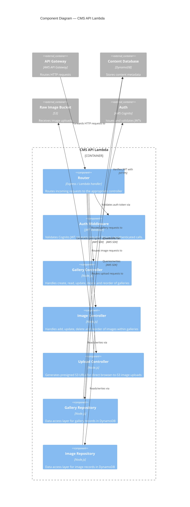

# C4 Level 3 — CMS API Components

```mermaid
C4Component
    title Component Diagram — CMS API Lambda

    Container_Ext(apiGateway, "API Gateway", "AWS API Gateway", "Routes HTTP requests")
    Container_Ext(dynamo, "Content Database", "DynamoDB", "Stores content metadata")
    Container_Ext(s3Raw, "Raw Image Bucket", "S3", "Receives image uploads")
    Container_Ext(cognito, "Auth", "AWS Cognito", "Issues and validates JWTs")

    Container_Boundary(api, "CMS API Lambda") {
        Component(router, "Router", "Express / Lambda handler", "Routes incoming requests to the appropriate controller")
        Component(authMiddleware, "Auth Middleware", "JWT Validator", "Validates Cognito JWT on every request. Rejects unauthenticated calls.")
        Component(galleryController, "Gallery Controller", "Node.js", "Handles create, read, update, delete and reorder of galleries")
        Component(imageController, "Image Controller", "Node.js", "Handles add, update, delete and reorder of images within galleries")
        Component(uploadController, "Upload Controller", "Node.js", "Generates presigned S3 URLs for direct browser-to-S3 image uploads")
        Component(galleryRepo, "Gallery Repository", "Node.js", "Data access layer for gallery records in DynamoDB")
        Component(imageRepo, "Image Repository", "Node.js", "Data access layer for image records in DynamoDB")
    }

    Rel(apiGateway, router, "Forwards HTTP requests to", "")
    Rel(router, authMiddleware, "Validates auth token via", "")
    Rel(authMiddleware, cognito, "Verifies JWT with", "HTTPS")
    Rel(router, galleryController, "Routes gallery requests to", "")
    Rel(router, imageController, "Routes image requests to", "")
    Rel(router, uploadController, "Routes upload requests to", "")
    Rel(galleryController, galleryRepo, "Reads/writes via", "")
    Rel(imageController, imageRepo, "Reads/writes via", "")
    Rel(uploadController, s3Raw, "Generates presigned upload URL for", "AWS SDK")
    Rel(galleryRepo, dynamo, "Queries/writes", "AWS SDK")
    Rel(imageRepo, dynamo, "Queries/writes", "AWS SDK")
```
